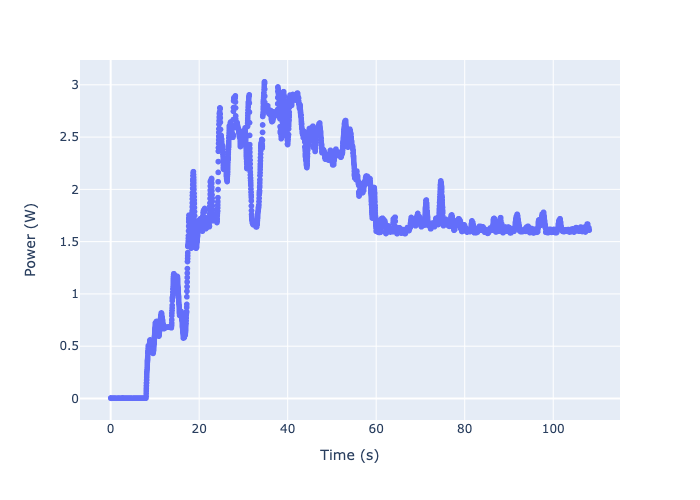

# shizuku

Python ooolset to extract and handle data from ShizukuRec provided by AVHzY CT-3 USB multimeters.

## Usage 

The toolset provides a command line tool, which reads a `.ShizukuRec` file and dumps its contents in the csv format. Usage is as follows:

```bash
$ python3 -m shizuku -h
usage: shizuku [-h] [-o [OUTFILE]] [-v] [infile]

Extract data from ShizukuRec files (AVHzY CT-3 USB multimeter) as csv.

positional arguments:
  infile                File to read

options:
  -h, --help            show this help message and exit
  -o [OUTFILE], --outfile [OUTFILE]
                        File to write csv dump
  -v, --verbose         Enable logging
```

## Library Usage

This toolset can also be used as a python library to handle `.ShizukuRec` files in your program. A simple example is presented in [etc/example.py](etc/example.py):

```python
from shizuku import ShizukuRec

with open("etc/example.ShizukuRec", "rb") as fd:
    rec = ShizukuRec(fd)

print(f"Duration: {rec.duration} s")

print(f"Average voltage: {sum(rec.voltage) / rec.samples:.3f} V")
print(f"Average current: {sum(rec.current) / rec.samples:.3f} A")

print(f"Total energy: {sum(rec.energy):.3f} Wh")
print(f"Total capacity: {sum(rec.capacity):.3f} Ah")
```

### Pandas support

When installed, the record file can also be accessed as a pandas dataframe, which is convenient i.e. for quick statistics or plotting with plotly express. An example can be found in [etc/vizualize.ipynb](etc/vizualize.ipynb):

```python
from shizuku import ShizukuRec
import plotly.express as px

with open("etc/example.ShizukuRec", "rb") as fd:
    rec = ShizukuRec(fd)

df = rec.dataframe.rolling("0.5S").mean()
fig = px.scatter(
    df,
    x="Time (s)",
    y="Power (W)",
)

fig.write_image("etc/example.png")
```

The resulting figure looks like this:



## Disclaimer

Scripts are provided on an "AS IS" basis, and I do not give any warranty, either express or implied. Use of the scripts is at your own risk

## Mentions

This implementation is heavily inspired by the prior work of [gierwialo](https://github.com/gierwialo/ShizukuRecFileExtractor) and forked and further developed.
